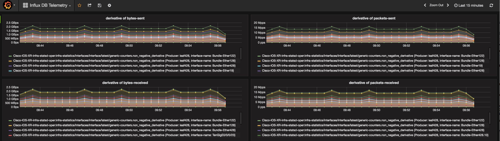
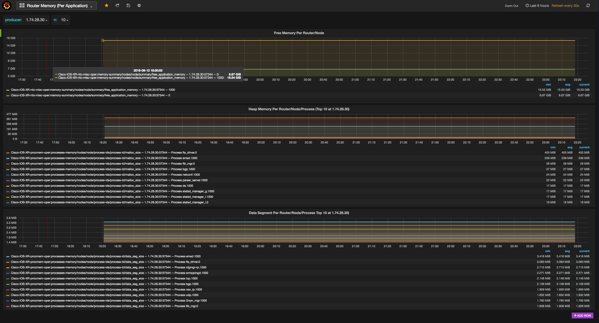
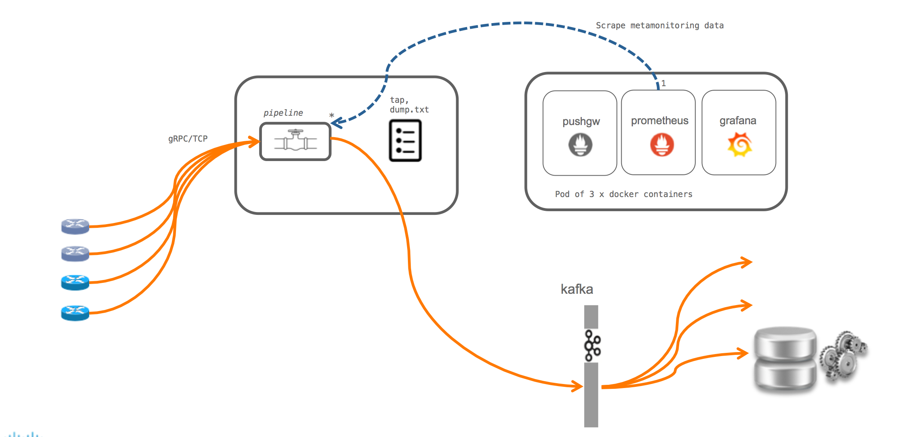
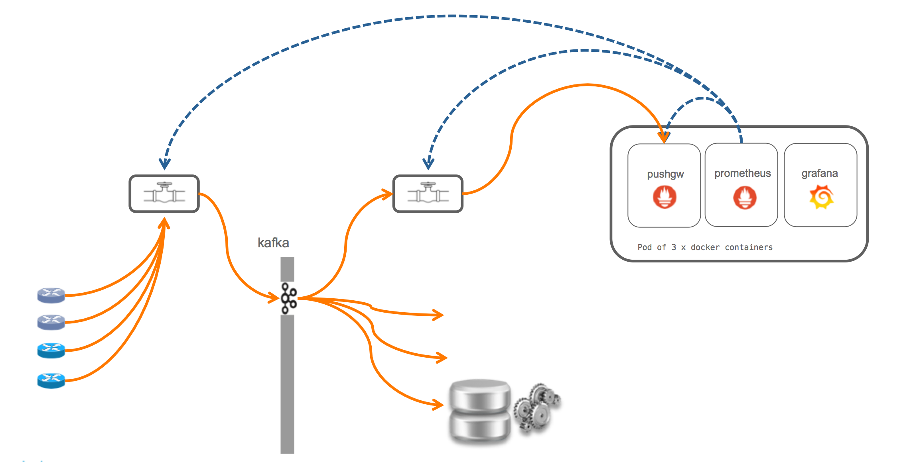
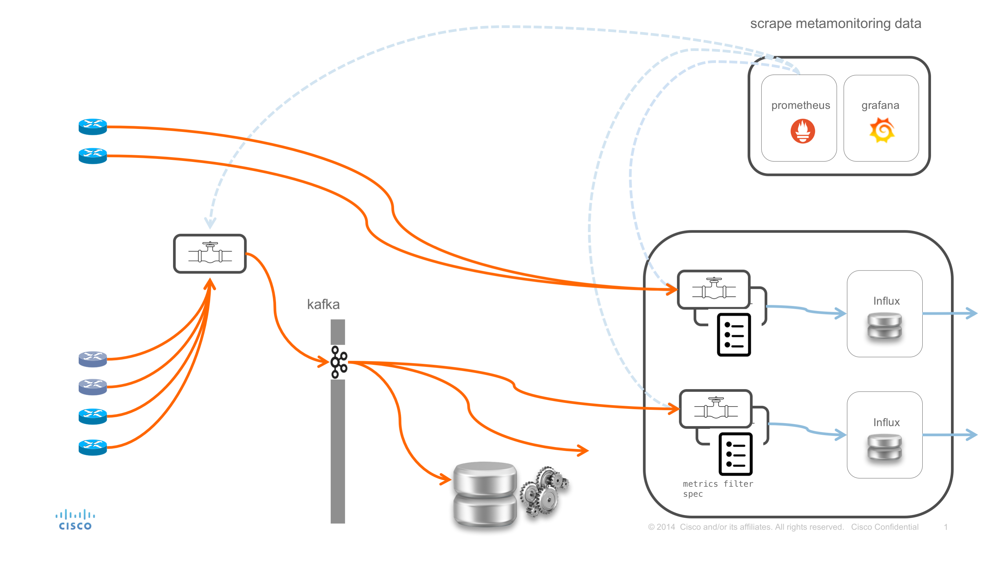
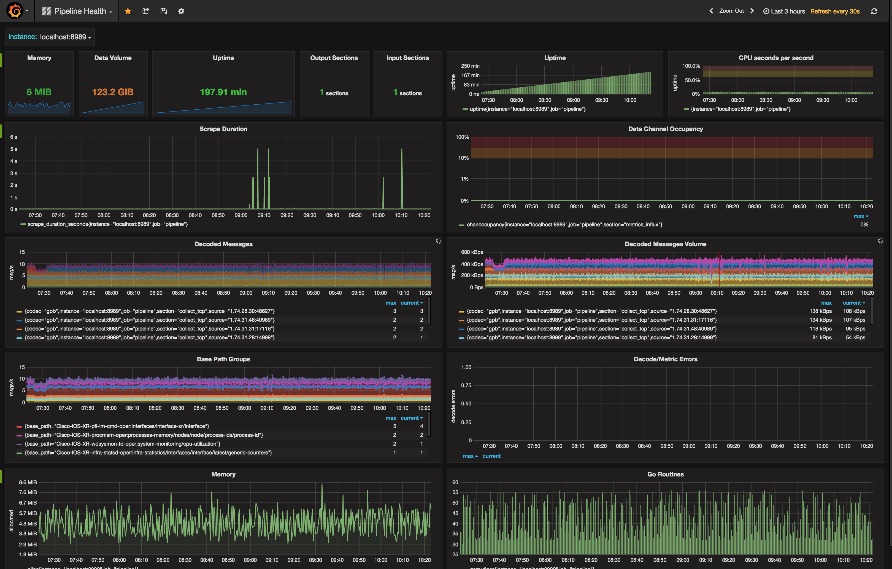

# *pipeline*

*pipeline* is an all-batteries-included utility which consumes IOS XR
telemetry streams directly from the router or indirectly from a
publish/subscribe bus. Once collected, *pipeline* can perform some
limited transformations of the data and forwards the resulting content
on to a downstream, typically off-the-shelf, consumer. Supported
downstream consumers include Apache Kafka, [Influxdata TICK
stack](https://docs.influxdata.com/),
[prometheus](https://prometheus.io), dedicated gRPC clients, as well
as dump-to-file for diagnostics.

Other consumers (e.g. [Elasticsearch](http://elasticsearch.org/),
[Splunk](https://www.splunk.com/)) can be setup to consume transformed
telemetry data off the kafka bus.

Transformations performed by pipeline include producing JSON (from
GPB/GPBKB inputs), template based transformation and metrics
extraction (for TSDB consumption).

The binary for *pipeline* is included under `bin`. This together with
the configuration file `pipeline.conf` and `metrics.json` (only if you
wish to export telemetry metrics to influxdb or prometheus) is all you
need to collect telemetry from Cisco IOS XR and NXOS routers.

A simple script is provided to setup monitoring of pipeline should it
be required. (See 'Monitoring the pipeline' below).

## *pipeline* inputs

*pipeline* supports multiple different input transport modules: TCP,
gRPC/HTTP2, UDP, Apache Kafka) carrying streaming telemetry.  Multiple
instances of any type of input module can be run in parallel.

*pipeline* supports running gRPC in both client and server mode on the
input side. When running in server mode, routers running dialout Model
Driven Telemetry (MDT) connect to *pipeline* and push content to
pipeline. When running in client mode, *pipeline* connects to routers
running MDT server side streaming (*pipeline* initiates connection to
router). A TLS option is available in both cases.

TCP supports `st` encoding; `st` wraps streaming telemetry payload
(e.g. as described in Telemtry .proto message) and wraps it up in a
simple streaming telemetry header. TCP input module can be setup with
TCP Keepalive (configuration option: `keepalive_seconds`) in order to
probe and validate connections in case connection is idle beyond the
keepalive period.

Compact GPB, GPB K/V and JSON payload can be carried over the
transport inputs supported.

Do note that the ability to decode compact GPB is dependent on the
subset of .protos compiled in via the
`bigmuddy-network-telemetry-proto` module in the vendor subtree. By
default, a popular subset of models is included, but others can be
pulled in and recompiled.

*pipeline* can also replay archives of streaming telemetry (operating
in headless mode without a network). The archives would have been
captured previously using the `tap` output module configured with
`raw=true` option. For details about the replay module, look at the
section 'Tap Module Type'.


## *pipeline* outputs

### Apache Kafka

On the output side, *pipeline* is capable of producing to multiple
kafka broker sets, with each *pipeline* input stage automatically
connected to each output stage. Depending on the input payload, it
will be possible to request a matching output; e.g. for compact GPB
input, we can publish JSON, JSON events or compact GPB messages. This
output stage allows us to bring telemetry to most consumers which can
consume off a kafka bus directly. Note that some transformation of the
payload can happen within pipeline (e.g. take compact GPB in on the
input side, produce JSON on the output side, take GPB K/V on the input
side, produce text template transformed content on to kafka.)

### Re-stream Over gRPC

*pipeline* can also operate an output stage as a gRPC server allowing
down stream consumers clients to connect to *pipeline*, and benefit
from server side streaming of (possibly transformed) content. The gRPC
service specification is included here: `xport_grpc_out.proto`.

### Metrics Extraction

The `metrics` output module allows *pipeline* to transform the
telemetry messages received into metrics streams which can then be
persisted to a TSDB like `influxdb` or `prometheus` and visualised
using off-the-shelf tools like `grafana`.



Another example shows memory utilisation per process:



The graphs present streaming telemetry data from a router configured
with the following paths:

```
sensor-group LOAD
  sensor-path Cisco-IOS-XR-wdsysmon-fd-oper:system-monitoring/cpu-utilization
  sensor-path Cisco-IOS-XR-nto-misc-oper:memory-summary/nodes/node/summary
  sensor-path Cisco-IOS-XR-procmem-oper:processes-memory/nodes/node/process-ids/process-id
  sensor-path Cisco-IOS-XR-infra-statsd-oper:infra-statistics/interfaces/interface/latest/generic-counters
```

The streams were collected by a running *pipeline*, and, in one case,
pushed to `InfluxDB`, and in the other, pushed to `prometheus` (via a
push gateway in order to retain timestamps). From there, the metrics
were queried and visualised using grafana.

An example recipe used by *pipeline* output metrics module to specify
which metrics to collect, and how to key them can be found here:

[Example metrics.json](metrics.json)

Note that both GPB and GPB K/V input can be processed by metrics
extraction. The output produced by the two forms is currently slightly
different, note that the recipe for GPB should be this:

[Example metrics.json for compact GPB](metrics_gpb.json)

The metrics output module can also be configured to dump metrics to a
local file for inspection and troubleshooting support. To do this,
simply uncomment out the `dump` directive and specify the filename to
dump to.

```
# For troubleshooting purposes, it is possible to
# dump the metrics to a local file, in order to understand what is
# being exported from persepective of *pipeline* metrics module.
#
# dump = metricsdump.txt

```

Sample dump output for `InfluxDB` output looks like this:

```
Server: http://fretta-ucs112.cisco.com:8086, wkid 0, writing 60 points in db: robot_alertdb
(prec: [ms], consistency: [], retention: [])
	Cisco-IOS-XR-infra-statsd-oper:infra-statistics/interfaces/interface/latest/generic-counters,EncodingPath=Cisco-IOS-XR-infra-statsd-oper:infra-statistics/interfaces/interface/latest/generic-counters,Producer=leaf428,interface-name=Null0 bytes-received=0,bytes-sent=0,carrier-transitions=0i,crc-errors=0i,input-drops=0i,input-errors=0i,input-ignored-packets=0i,input-queue-drops=0i,output-buffer-failures=0i,output-drops=0i,output-errors=0i,output-queue-drops=0i,packets-received=0,packets-sent=0 1481581596836000000
	Cisco-IOS-XR-infra-statsd-oper:infra-statistics/interfaces/interface/latest/generic-counters,EncodingPath=Cisco-IOS-XR-infra-statsd-oper:infra-statistics/interfaces/interface/latest/generic-counters,Producer=leaf428,interface-name=Bundle-Ether2 bytes-received=470058,bytes-sent=430384,carrier-transitions=0i,crc-errors=0i,input-drops=0i,input-errors=0i,input-ignored-packets=0i,input-queue-drops=0i,output-buffer-failures=0i,output-drops=0i,output-errors=0i,output-queue-drops=0i,packets-received=3709,packets-sent=3476 1481581596836000000
	Cisco-IOS-XR-infra-statsd-oper:infra-statistics/interfaces/interface/latest/generic-counters,EncodingPath=Cisco-IOS-XR-infra-statsd-oper:infra-statistics/interfaces/interface/latest/generic-counters,Producer=leaf428,interface-name=Bundle-Ether3 bytes-received=8270089146,bytes-sent=8270761380,carrier-transitions=0i,crc-errors=0i,input-drops=0i,input-errors=0i,input-ignored-packets=0i,input-queue-drops=0i,output-buffer-failures=0i,output-drops=0i,output-errors=0i,output-queue-drops=0i,packets-received=66694385,packets-sent=66702839 1481581596836000000
```

In this example consistency and retention policy are not specified and
fall back to the default.

Sample dump output for `prometheus` output looks like this:

```
packets_received{Basepath="Cisco-IOS-XR-infra-statsd-oper:infra-statistics/interfaces/interface/latest/generic-counters",Producer="1.74.28.30:53909",interface_name="HundredGigE0/0/1/3"} 244204 1470694071166
bytes_received{Basepath="Cisco-IOS-XR-infra-statsd-oper:infra-statistics/interfaces/interface/latest/generic-counters",Producer="1.74.28.30:53909",interface_name="HundredGigE0/0/1/3"} 16324149 1470694071166
packets_sent{Basepath="Cisco-IOS-XR-infra-statsd-oper:infra-statistics/interfaces/interface/latest/generic-counters",Producer="1.74.28.30:53909",interface_name="HundredGigE0/0/1/3"} 24 1470694071166
bytes_sent{Basepath="Cisco-IOS-XR-infra-statsd-oper:infra-statistics/interfaces/interface/latest/generic-counters",Producer="1.74.28.30:53909",interface_name="HundredGigE0/0/1/3"} 1680 1470694071166
output_drops{Basepath="Cisco-IOS-XR-infra-statsd-oper:infra-statistics/interfaces/interface/latest/generic-counters",Producer="1.74.28.30:53909",interface_name="HundredGigE0/0/1/3"} 0 1470694071166
carrier_transitions{Basepath="Cisco-IOS-XR-infra-statsd-oper:infra-statistics/interfaces/interface/latest/generic-counters",Producer="1.74.28.30:53909",interface_name="HundredGigE0/0/1/3"} 0 1470694071166
```

The output module is implemented in a way which makes supporting other
metrics consumers easy. For example adding support for
[druid](https://druid.io) or [OpenTSDB](http://opentsdb.net/) would
require implementing a simple adaptation interface.

A description of the configuration options is available in the
[annotated pipeline.conf](pipeline.conf). A sample configuration for
an `influx` setup might look like this:

```
[metrics_influx]
stage = xport_output
type = metrics
file = metrics.json
output = influx
influx = http://influx.example.com:8086
database = alertdb
workers = 10
datachanneldepth = 1000
```

When the Influx configuration is run for the first time,
username/password credentials are requested. If a key pair is provided
via the `-pem` option (run `pipeline -help` for details`), then an
alternative configuration file (with `_REWRITTEN`) suffix is written
including the encrypted password. This `_REWRITTEN` configuration can
be used to avoid the interactive stage in subsequent pipeline runs.

An example setup for a `prometheus` setup might look like this:

```
[poc_metrics]
stage = xport_output
type = metrics
file = metrics.json
datachanneldepth = 1000
output = prometheus
pushgw = prometheus.example.com:9091
jobname = telemetry
instance = pipelinemetrics
```

### Tap Module Type

The 'tap' output module can be used to dump decoded content for
troubleshooting purposes too. This module attempts to publish content
in JSON, and falls back to a hex dump (e.g. if corresponding .proto
package is not available).

Full support is provided for compact GPB decoding; as long as the
`.proto` golang binding has been imported. A common set (approximately
a quarter of all models) is automatically imported into *pipeline*.

#### Replaying Archive of Telemetry Streams

The `tap` output module can also be used to capture raw data to file
simply by replacing the `encoding` option with a `raw=true`
option. With a configuration like the following, all input streams
would be captured and dumped into `dump.bin`:

```
[tap_out_bin]
stage = xport_output
type = tap
raw = true
file = dump.bin
datachanneldepth = 1000
```

The content can be subsequently replayed using the `replay` input
module. The `replay` input module can replay the archive in a loop, or
for a finite number of messages (using the `firstn` option). The inter
message gap can be controlled using the `delayusec` option. Below is a
`replay` configuration snippet which would replay 1000 messages using
the archive in `dump.bin` with an intermessage delay of a 100us. The
archive could contain fewer messages than requested, in which case
replay loops back to the start of the archive (do note that timestamps
will appear reordered in such a case). An unspecified delay or a delay
of 0 usec, will result in no measurable intermessage delay. In order
to loop continuously through the archive, replace firstn option with
loop=true.:

```
[replay_bin_archive]
stage = xport_input
type = replay
file = dump.bin
firstn = 1000
delayusec = 100000

```

### Text Template Transformation

Finally, output to kafka, tap and the grpc server can be manipulated
using a text template engine. Further documentation will be added to
support run time content transformation in the field. In the meantime
an example can be found here:

[Example text template spec](filter_test.json)

The [template language is documented here](https://golang.org/pkg/text/template/).

## Credentials

Passwords are not stored in the clear in `pipeline.conf`. Whenever a
password is required in interaction with some other service (e.g. gRPC
dialin, Influx user credentials etc), pipeline adopts a consistent
approach whereby passwords are stored encrypted by a public key.

The production workflow assumes that `pipeline.conf` is setup, for the
specific input or output module/s, with an encrypted password. When an
encrypted password is configured (in the form
`password=<ciphertext>`), *pipeline* runs in a non-interactive way and
expects the `-pem` option to lead to the private key. This private key
is used to decrypt the password ciphertext whenever the password is
required.

The production workflows looks like this:

- pipeline run with a pipeline.conf including username and encrypted
passwords
- pem file previously used to encrypt passwords passed in as a
command line argument to *pipeline*.

The one-time workflow to generate the password ciphertext is as follows:

- make sure no username/password credentials are configured in the
configuration file for the input/output module/s you wish to generate
the password ciphertext for.
- run *pipeline*, passing in the -pem option (pem provides the public
key available for enoding with). This will result in an interactive
session where user is prompted for username and password. For
convenience, the configuration file is rewritten as
`<pipeline.conf>_REWRITTEN` with the username and password ciphertext
included.

This rewritten configuration can be used directly in subsequent
non-interactive runs using an invocation such as;

```
 ./pipeline -pem=./id_rsa -config pipeline.conf_REWRITTEN
```


# Deployment

The input and ouput modules can be combined in different ways across a
number of *pipeline* instances to accommodate a customer
deployment. For example, in its simplest form, a *pipeline* can be
deployed with MDT gRPC + GPB K/V as its input stage, and tap as its
output stage if all that is required is textual inspection of a JSON
representation of the streams.

Alternatively, the kafka output plugin may be setup alongside or
instead of the tap output plugin to feed kafka and kafka consumers as
shown here:



Yet another alternative is to have a primary *pipeline* consume MDT
telemetry streams and push on to kafka, and a secondary instance of
*pipeline* consuming from kafka, and, for example, feeding metrics
straight into prometheus as shown in the figure below:



The third and final example shows multiple *pipeline* instances, some
consuming telemetry from routers, and others consuming from kafka.
On the output side, some instances are feeding kafka, whereas others
are feeding a TSDB, InfluxDB in this case. In all case, *pipeline*
instances are being scraped for monitoring purposes using prometheus.
Note how the example includes a case where a *pipeline* instance is
collecting directly from the router and feeding InfluxDB directly. The
example also includes, what is probably a more production friendly
scenario with a *pipeline* instance collecting from routers and
feeding kafka, and other *pipeline* instances collecting from kafka
and feeding InfluxDB. This way, should other applications wish to
consume telemetry streams too, they can simply subscribe to kafka.




# Running

CLI options allow *pipeline* to be started with extra debugging, and
with configuration file and log file changed from the default of
`pipeline.conf` and `pipeline.log` respectively.

```
gows/src/pipeline$./pipeline --help
Startup pipeline
pipeline, version 0.6.1

  -config="pipeline.conf": Specify the path and name of the configuration file
  -debug=false: Dump debugging information to logfile (for event dump see 'logdata' in config file)
  -log="pipeline.log": Specify the path and name of log file

```

Running...

```
gows/src/pipeline$./pipeline
Startup pipeline
Load config from [pipeline.conf], logging in [pipeline.log]
Wait for ^C to shutdown
^C

```

and stopping...

```

Interrupt, stopping gracefully

 Stopping input 'myrouters'
 Stopping output 'mykafka'
Done
```

Logging output is stuctured to support log analysis. If the `-log`
command line option is specified and empty i.e. `-log=`, then log
information is pushed to stdout, as well as fluentd if configured.

In order to monitor statistics like the number of messages flowing
through *pipeline*, errors, queue depths etc, refer to the section
"Monitoring pipeline" below.


## Configuration

Configuration is currently provided at startup in the form of a
configuration file. The configuration is built of named sections with
each section representing an input or output stage of a specified
type, with other per type attributes. Here is a self-explanatory
configuration file with a single input and output section:

[Annotated pipeline.conf](pipeline.conf)

Any number of input and output sections are supported. Note that
currently all inputs are connected to all outputs.

In future, some level of dynamic configuration may be supported
providing programmatic control of pipeline.

### Configuration Template With Environment Variables

At any point in the configuration file it is possible to embed
template text of the form `{{.Env "ENVIRONMENT_VARIABLE"}}`. Any such
text, embedded anywhere in the configuration file, will be translated
at runtime to the environment variable content. If the variable is not
set, configuration will fail, and complain accordingly.

Example: consider a setup with two input sections; one terminate gRPC
and another TCP dialout:

```
[lab-sjc]
stage = xport_input
type = tcp
encap = st
listen = my.example.com:4668
keepalive_seconds = 7200

[lab-uk]
stage = xport_input
type = grpc
encap = gpbkv
listen = my.example.com:4669
```

In order to provide the `listen` parameters as environment variables,
e.g.  TCP_ENDPOINT and GRPC_ENDPOINT, the configuration would need to
be set up as follows:

[lab-sjc]
stage = xport_input
type = tcp
encap = st
listen = :{{.Env "TCP_ENDPOINT"}}

[lab-uk]
stage = xport_input
type = grpc
encap = gpbkv
listen = {{.Env "GRPC_ENDPOINT"}}

Note that wherever the `{{}}` appear, a translation would be attempted
in a preprocessing stage prior to loading the configuration.

### Configuration - `grpc`, `encap` and `encoding`

There are two disinct scenarios when using `grpc` as the `xport_input`
stage. While the router is always the party streaming content, the
router can either be acting in server role or client role. The role
determines whether *pipeline* needs to be setup as the complimentary
server ('listen=' directive specifies socket to listen on) or client
('server=' specifies the router to connect to). When *pipeline* is the
client and initiates the connection to the router, the encoding to
request must be configured ('encoding=' directive). On the other hand,
if the *pipeline* is in the role of server, then whatever encoding is
pushed from the router will be consumed so no `encoding` directive is
required. The unified GPB header is sufficient for *pipeline* to
determine what codec needs to be applied.

In the case of `tcp` as `xport_input` with encapsulation set to `st`,
pipeline can handle both prerelease and unified header encapsulation
i.e. there is no need to specify the type of encoding expected.

Input encoding to output encoding matrix table:

|input enc  | metrics | json | json_events | gpb | template xform |
|-----------|---------|------|-------------|-----|----------------|
|gpbkv      | yes     | yes  | yes         | yes(k/v) |      yes       |
|gpbcompact | yes     | yes  | yes         | yes |      no        |
|json       | no      | yes  | no          | no  |      no        |

Templating transformation for gpbcompact is expected [to be added
shortly](https://github3.cisco.com/ROBOT/pipeline/issues/4). Templating
transformation works with the following output stages: kafka, gRPC
server, tap.

The encodings json, json_events and gpb (compact and k/v) can be
pushed through kafka output module, tap and gRPC server. Metrics
encoding can currently be pushed to a time series database (influx and
prometheus are supported today).

TCP, gRPC (dialin and dialout) and kafka input modules can handle all
three input formats.

---

# Monitoring *pipeline*

*pipeline* exports internal state for visualisation purposes. The
address and port used by *pipeline* are controlled through the
`metamonitoring_prometheus_server` global attribute in the default
section of `pipeline.conf`.

The following is an example of a grafana dashboard composed and used
to monitor the *pipeline* itself:



A script `run.sh` available under `tools/monitor` can be invoked to
run `prometheus` and `grafana` containers. By default, these are
configured to scrape a local instance of *pipeline* exporting to the
default port `:8989`. Simply point your browser at that host on port
`:3000`, and a collection of dashboards provide for monitoring of the
pipeline. These dashboards are configurable.

If you are running a fleet of *pipeline* instances, simply modify
`tools/monitor/data_prom4ppl/prometheus.yml` to include multiple
targets in the static configuration section for `job_name`
*pipeline*. Equally if pipeline is running on a remote host simply
replace `localhost:8989` with the appropriate remote host address.

The content in the `tools/monitor` tree and a running `docker`
instance is all that is required to monitor pipeline.

___

[Project Avatar](https://thenounproject.com/term/pipeline/216568/) [CC](http://creativecommons.org/licenses/by/3.0/us/)
